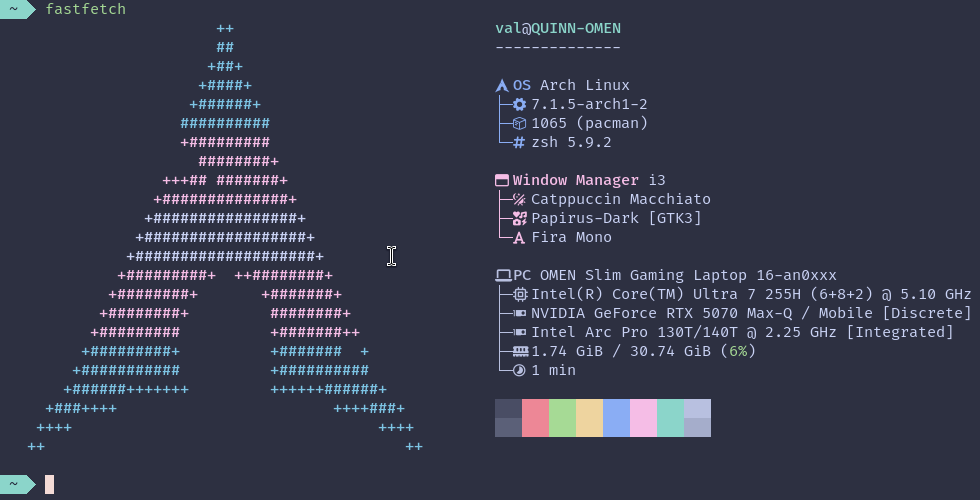

# QVC Dotfiles

<p align="center">
	<svg width="340" height="170" viewBox="0 0 1000 500" xmlns="http://www.w3.org/2000/svg" role="img" aria-label="QVC Logo">
		<defs>
			<radialGradient id="qvcLavenderMauve" cx="100%" cy="100%" r="150%">
				<stop offset="0%" stop-color="#c6a0f6"/>
				<stop offset="100%" stop-color="#b7bdf8"/>
			</radialGradient>
		</defs>
		<g fill="url(#qvcLavenderMauve)">
			<path d="m 759.31903,100.68378 c -71.26909,1.17203 -129.41205,49.02313 -130.18407,149.92418 -0.77408,101.17066 63.76318,148.64588 132.95956,149.38466 88.51448,0.94504 117.56747,-59.56174 120.78539,-98.01273 l -27.31352,-0.22006 c -4.4032,42.27907 -34.69238,70.3482 -93.18864,69.67275 -63.3298,-0.73126 -103.11712,-42.85593 -104.96171,-120.72765 -1.5973,-67.43205 38.61875,-123.26734 101.42395,-121.84927 50.00891,1.12914 85.22696,16.48527 96.63131,70.60137 h 27.40814 v -0.2589 C 869.59538,129.21424 821.03178,99.668905 759.31903,100.68378 Z" />
			<path d="m 626.73483,100 -50.88729,125.50015 -70.77897,172.62953 c 7.77715,15.46547 21.32682,25.46734 37.3629,25.48091 h 20.02042 l 297.15487,-0.94953 C 893.94377,423.16143 911.43322,406.36529 909.86149,370 l 1.36509,-245.45494 c 1.3651,-39.602603 -28.6349,-46.05977 -48.6349,-46.05977 L 404.92698,77.167987 C 400.0098,69.074973 387.82782,49.53325 370.63751,50 l 491.95417,-3e-6 c 50,0 74.78547,36.545467 74.91503,75.643923 L 937.49033,370 c -0.0593,52.31872 -24.89864,80 -78.59389,81.61524 l -294.10527,0.0139 H 547.1101 C 515.15274,451.64167 492.80431,430 480.76325,411.01304 l -3.02107,-5.61768 -2.93787,-6.6296 -34.85508,-87.39716 -65.54681,-163.06791 -6.21225,-15.13001 C 353.75799,100.28988 340,80.000001 299.2308,77.413596 L 120,77.130852 C 95.192304,74.109688 74.870454,100.28988 75.446586,124.00551 L 75.162465,380.24184 C 75.523982,410 90.369248,424.24856 120.34725,424.24856 h 181.59811 c 6.17796,9.12472 13.82173,19.48734 20.12965,27.39311 H 120 C 76.070802,450 45.100255,422.66106 45.85927,383.20412 L 45.767826,124.43248 C 45.075802,80.000001 80.000001,50 120,50.250976 l 183.15337,0.250976 C 350,50 370.04037,67.984971 387.13971,104.882 l 4.54037,9.797 29.13826,72.28788 29.13833,72.28783 19.90428,51.38685 19.90425,51.38683 0.67123,-1.08605 0.67129,-1.08611 8.2874,-21.72186 8.28739,-21.72184 16.4025,-40.90703 16.4025,-40.90713 37.31549,-91.90076 17.20717,-42.68834 z" />
			<path d="m 228.87544,100.3055 c -84.65593,0.0968 -129.817195,76.00703 -128.53711,150.07146 1.68678,97.59554 64.19521,148.20284 132.01854,149.68643 11.63064,0.25441 29.28313,-0.0613 41.19438,-5.26741 15.16048,20.06839 26.87693,36.63373 41.84499,56.84562 h 174.88545 c -19.82094,0 -33.69045,-27.70787 -33.69045,-27.70787 0,0 -115.08587,-0.39619 -124.40584,-0.47439 -12.35133,-15.42431 -18.84694,-28.10777 -30.69168,-43.92032 48.19905,-27.7361 62.24313,-100.85203 62.54837,-128.93269 0.63115,-58.06325 -22.21325,-150.42998 -135.16665,-150.30083 z m 106.46275,150.27764 c -2.60603,68.25176 -42.93315,99.64174 -47.38006,106.93198 l -45.07682,-59.44444 -32.51224,-0.53317 51.08888,71.8845 c -9.45745,3.26371 -20.98864,3.47837 -30.93558,3.18795 -13.6473,-0.39846 -102.98946,-15.70011 -104.56426,-122.00232 -1.03428,-69.81602 51.2948,-124.85761 102.73006,-124.38055 57.40891,0.53246 109.93005,38.45246 106.65002,124.35605 z" />
		</g>
	</svg>
</p>

<h3 align="center">
	<br/>
	
	Catppuccin Macchiato
</h3>

Opinionated dotfiles for a keyboard-first desktop setup that is:

- Built mainly for Arch Linux.
- Also includes install paths for Ubuntu/WSL and macOS.
- Focused on X11 + i3wm.
- Minimal in tooling where possible.
- GTK-first in app/theming choices where possible.

The goal is a cohesive daily-driver environment around Alacritty, Neovim, i3, and Catppuccin Macchiato.

## Screenshots

<p align="center">
  
</p>

<p align="center">
  <em>Desktop screenshot coming soon.</em>
</p>

## Table of Contents

- [Philosophy](#philosophy)
- [Platform Support](#platform-support)
- [Quick Start](#quick-start)
- [What Gets Installed](#what-gets-installed)
- [Theme Stack](#theme-stack)
- [Desktop Stack (X11 + i3)](#desktop-stack-x11--i3)
- [i3 Bar and Status Modules](#i3-bar-and-status-modules)
- [Wallpaper Rotation Service](#wallpaper-rotation-service)
- [Lock Screen (i3lock)](#lock-screen-i3lock)
- [Keybinds and Workflow](#keybinds-and-workflow)
- [GRUB Theme (Manual Final Step)](#grub-theme-manual-final-step)
- [Repo Layout](#repo-layout)
- [Known Rough Edges](#known-rough-edges)

## Philosophy

This repo aims for consistency, speed, and low-friction customization:

- Keep core tools simple and composable.
- Prefer common Linux-first utilities over heavy wrappers.
- Keep UI coherent with Catppuccin Macchiato colors everywhere practical.
- Prefer GTK-friendly applications and GTK portals where possible.
- Keep startup behavior predictable (especially on Arch + tty1 + startx + i3).

## Platform Support

### Primary: Arch Linux

The deepest support and the most complete setup path is Arch. This path configures:

- X11 + i3wm session startup.
- Wallpaper rotation via systemd timer/service.
- i3lock-color, i3blocks, rofi, dunst, picom.
- GTK theme and icon plumbing.
- Larger package set for a complete workstation.

### Secondary: Ubuntu / WSL

There is a lighter path for Ubuntu, intended mostly for WSL and continuity of terminal tooling:

- Installs zsh/curl/git/exa and Neovim.
- Clones tmux TPM plugin manager.
- Links Alacritty config into a Windows Alacritty config location.

This gives enough parity to keep shell/editor habits consistent across environments.

### Secondary: macOS

There is a separate macOS install path with Homebrew-centric provisioning:

- Ensures zsh usage.
- Installs and updates Homebrew.
- Runs segmented installers for terminal tools, software, languages, and dependencies.

## Quick Start

Run from your home directory (or after cloning into ~/.dotfiles):

```sh
sudo ./init.sh
```

What init does at a high level:

1. Detects OS/distro.
2. Runs platform-specific setup.
3. Runs shared symlink setup.
4. Offers reboot.

## What Gets Installed

On Arch, this setup installs a broad baseline including:

- Shell and terminal: zsh, alacritty.
- Editor/dev: neovim, ripgrep, fd, fzf, nodejs, python, pip, ipython, VS Code.
- WM/session: i3-wm, i3status/i3blocks, rofi, picom, xorg/xinit.
- Media and desktop: pipewire, firefox, spotify-launcher, vlc, thunar stack, flameshot, dunst.
- Theming: catppuccin GTK theme, papirus icons/folders, nerd fonts.
- Utilities: htop/nvtop, xclip/xsel, xdotool/maim, xdg-portal packages, bluetooth tools, and more.

Several AUR packages are installed with yay, including i3lock-color, Catppuccin GTK theme, Papirus folder theming, and related desktop tools.

## Theme Stack

This setup is consistently themed around Catppuccin Macchiato:

- Alacritty imports catppuccin-macchiato color definitions.
- i3 uses Catppuccin palette variables for borders, workspaces, and bar styling.
- i3blocks uses color blocks mapped to Macchiato palette values.
- dunst notifications use matching background/frame/text colors.
- GTK theme is set to catppuccin-macchiato-mauve-standard+default.
- Papirus icon and cursor themes are used with catppuccin folder recoloring.

Result: terminal, WM, notifications, and GTK apps all feel like one cohesive UI.

## Desktop Stack (X11 + i3)

This system is intentionally built around classic X11 + i3wm, not a full desktop environment.

Startup behavior:

- On Arch, login on tty1 starts X automatically from profile logic.
- xinitrc launches i3 and sets up DBus environment integration.
- i3 starts key session components (picom, dunst, autorandr, wallpaper, lock flow).

Why this matters:

- Fast startup.
- Low idle overhead.
- Fully keyboard-navigable workflow.
- Very explicit control over every moving part.

## i3 Bar and Status Modules

Bar details:

- Uses i3bar + i3blocks.
- Font: FiraCode Nerd Font.
- Segment-style color transitions using powerline separators.

Current i3blocks modules include:

- CPU usage and CPU temperature.
- GPU usage and GPU temperature.
- Memory usage.
- Network state.
- Time and date.
- Power menu launcher.
- Battery status.

The bar is intentionally dense but scannable: system health, connectivity, and power controls are all visible at a glance.

## Wallpaper Rotation Service

There is a custom systemd wallpaper setup for Arch:

- [arch/wallpaper.service](arch/wallpaper.service)
- [arch/wallpaper.timer](arch/wallpaper.timer)
- [arch/wallpaper.sh](arch/wallpaper.sh)

How it works:

1. Timer starts 10 minutes after boot.
2. Runs every 3 hours.
3. Script chooses random wallpaper(s) from the wallpaper directory.
4. Uses feh to apply:
	 - One wallpaper for single monitor.
	 - Two distinct wallpapers for dual monitor setups.

Wallpapers live in [arch/wallpapers](arch/wallpapers) and include a large mixed collection (minimal, scenic, anime, abstract, catppuccin-flavored, etc.).

## Lock Screen (i3lock)

Locking is handled with i3lock-color and a Catppuccin-tuned color palette:

- Random wallpaper image background from wallpaper set.
- Ring and state colors mapped to palette accents (blue/red/green style semantics).
- Integration with xss-lock for lock-on-suspend behavior.

You get both:

- Secure session lock behavior.
- Visual consistency with the rest of the desktop.

## Keybinds and Workflow

Mod key is Super (Mod4).

Core workflow shortcuts:

- Open terminal: Mod+Return
- App launcher (rofi combi): Mod+d
- Kill focused window: Mod+Shift+q
- Reload i3 config: Mod+Shift+c
- Restart i3 inplace: Mod+Shift+r
- Enter resize mode: Mod+r

Navigation (vim-style + arrows):

- Focus: Mod+j/k/l/semicolon
- Move window: Mod+Shift+j/k/l/semicolon

Layout controls:

- Horizontal split: Mod+h
- Vertical split: Mod+v
- Fullscreen: Mod+f
- Stacking/Tabbed/Toggle split: Mod+t / Mod+w / Mod+e
- Floating toggle: Mod+Shift+space

Workspace model:

- 20 workspaces mapped to number rows with extra Alt combinations.
- Workspaces 1-10 pinned to eDP-1.
- Workspaces 11-20 pinned to HDMI-1-0.

Locking and screenshots:

- Lock (random wallpaper): Mod+Escape
- Lock (solid style): Mod+Shift+Escape
- Screenshot to file/clipboard and Flameshot bindings are included.

Audio and brightness keys:

- XF86 volume keys call custom scripts with dunst feedback.
- XF86 brightness keys call custom script with progress-style dunst notifications.

## GRUB Theme (Manual Final Step)

Important: the install script clones and copies Catppuccin GRUB theme assets into /usr/share/grub/themes, but does not currently enable the theme automatically in /etc/default/grub.

That means the assets are present, but final activation is manual.

### Manual activation steps

1. Edit GRUB defaults:

```sh
sudoedit /etc/default/grub
```

2. Add or update this line:

```sh
GRUB_THEME="/usr/share/grub/themes/catppuccin-macchiato-grub-theme/theme.txt"
```

3. Regenerate GRUB config:

```sh
sudo grub-mkconfig -o /boot/grub/grub.cfg
```

4. Reboot and verify theme load.

Notes:

- If your distro/boot layout uses a different GRUB output path, adjust the grub-mkconfig destination accordingly.
- The script already installs what you need; this is just the final switch-on step.

## Repo Layout

High-level map:

- init.sh: OS detection and orchestration.
- init/arch.sh: full Arch install and desktop provisioning.
- init/mac.sh: macOS path via Homebrew and segmented scripts.
- init/all/link.sh: shared symlink setup (~/.config, zsh profile, zshrc, xinitrc).
- xinitrc: X11 session start and i3 launch.
- profile.sh: login-time behavior (including tty1->startx flow on Arch).
- config/: user config tree (i3, i3blocks, alacritty, nvim, dunst, picom, etc).
- arch/: Arch-specific systemd units, wallpaper rotation script, and wallpaper assets.

## Known Rough Edges

- GRUB theme is copied but not auto-enabled (manual step above).
- Some setup paths are intentionally interactive (prompts before replacing existing files).
- Arch is the canonical target; macOS/WSL paths are useful but less exhaustive.

If you want this repo to feel exactly like the author environment, start with Arch + i3 on X11 and treat other platforms as portability layers.